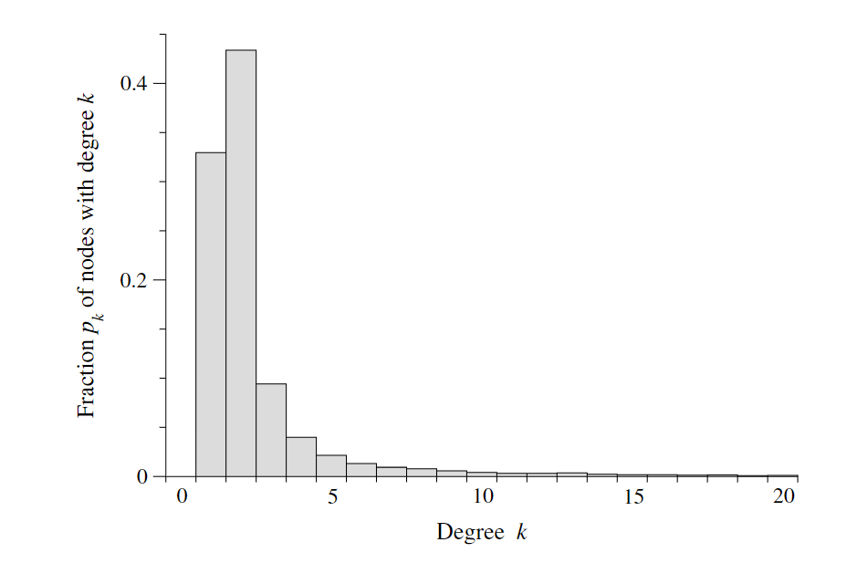
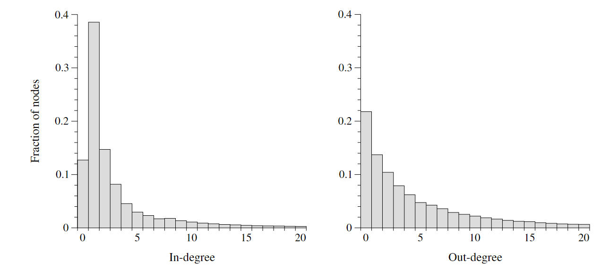

# 10.3 degree distribution 度分布
网络中各个节点度分布情况，

采用$p_k$表示度值为k的节点占网络中所有节点的比例，$np_k$为度值为k的节点数量 

>Figure 10.3: The degree distribution of the Internet. A histogram of the degree
distribution of the nodes of the Internet at the level of autonomous systems

对于有向网络，通常将节点的入度和出度分开统计，如下

> Figure 10.4: The degree distributions of the World Wide Web. Histograms of the distributions of in- and out-degrees
of pages on the World Wide Web. Data are from the study by Broder et al. [84]

除分开统计网络入度出度分布外，我们还统计指标$P_{jk}$，其表示**出度**为k**入度**为j的节点所占总节点的比例，这一指标可以绘制出一个热力图，我们能从其中看到节点入度和出度的相关性