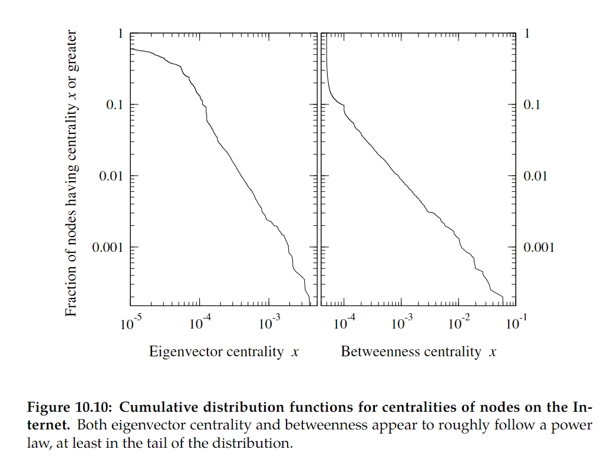
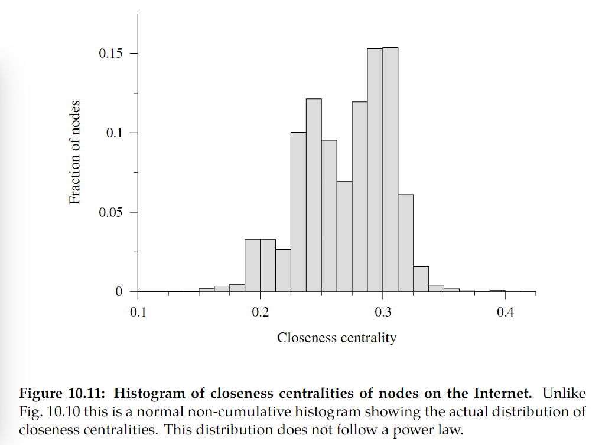

# Distributions of other centrality measures 其他中心性的分布
- 特征向量中心性分布（Eigenvector centrality ）
- 介数中心性分布（Betweenness centrality ）
  以上二者均存在右偏现象，其尾部常有幂律分布

- 接近中心性（closeness centrality）它是从节点到所有其他可到达节点的平均最短路径距离的倒数。其分布类似正态分布，值集中在某一小范围内

