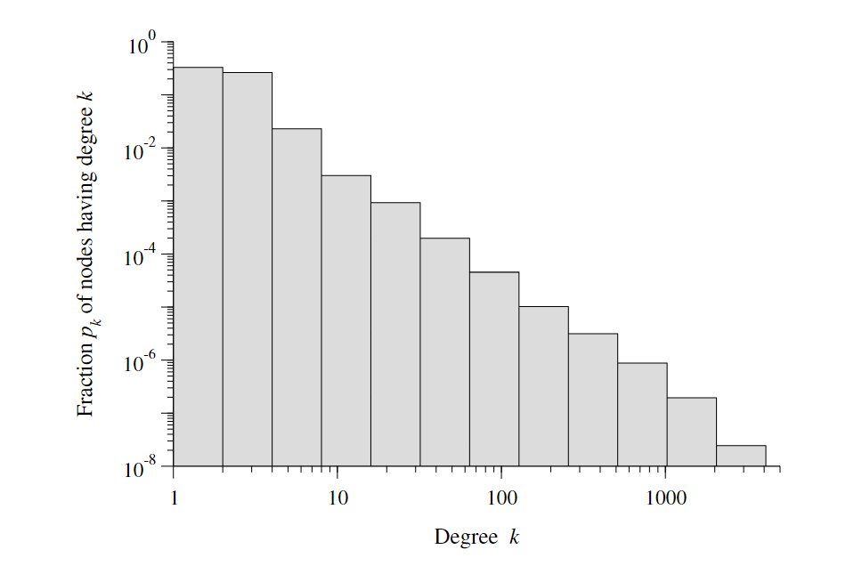
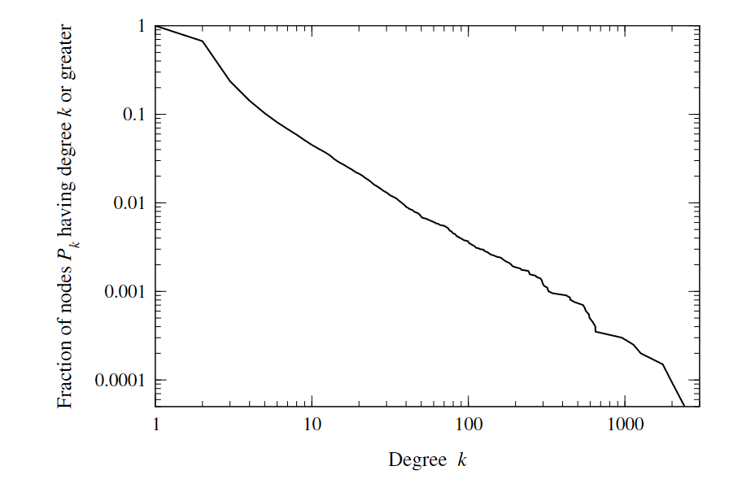

# Power law and scale free network 幂律分布与无标度网络
对于一个网络，如果我们绘制其度分布直方图时采用双对数坐标的形式，使得其度与该度的概率呈现一定的线性关系，我们可以近似认为该网络的度分布存在幂律分布的特点。拟定方程如下：
$$\ln p_{k}=-\alpha \ln k+c$$
对两边求其指数：
$$p_{k} = C k^{-\alpha}$$

其中$\alpha$为幂律分布的指数

具有幂律分布的网络常被称为无标度网络，

## detecting and visualizing power laws 检验并可视化幂律分布

绘制双对数直方图来提示度分布是否呈现幂律分布情况存在某些问题，对于直方图中每个区块，采用等度数（每个bin的宽度代表相同的度值区间）直方图即会使得其尾部概率（宽度？）较小，

另外可以采用变化bin宽度来调整直方图，bins宽度成指数变化（如下所示）

>Figure 10.6: Histogram of the degree distribution if the Internet, created using loga-
rithmic binning

另外可采用累计分布函数，将纵坐标$p_k$改为$P_k$，即为度为k或更大度值的节点所占比例
$$P_{k}=C \sum_{k^{\prime}=k}^{\infty} k^{\prime-\alpha} \simeq C \int_{k}^{\infty} k^{\prime-\alpha} \mathrm{d} k^{\prime}=\frac{C}{\alpha-1} k^{-(\alpha-1)}$$

上式用积分的形式代替了求和，但事实上度值分布是离散的。另外度分数累计值与度值呈现幂律分布，指数值相较度分数的小1

> Figure10.7: Cumulativedistribution functionfor thedegreesof nodeson theInternet

直接计算$\alpha$
$$\alpha = 1+N\left(\sum_{i} \ln \frac{k_{i}}{k_{\min }-\frac{1}{2}}\right)^{-1}$$

## Properties of power-law distributions（幂律分布的性质）
- 度分数$p_k$总和为1
- **时刻moments**（不太懂）