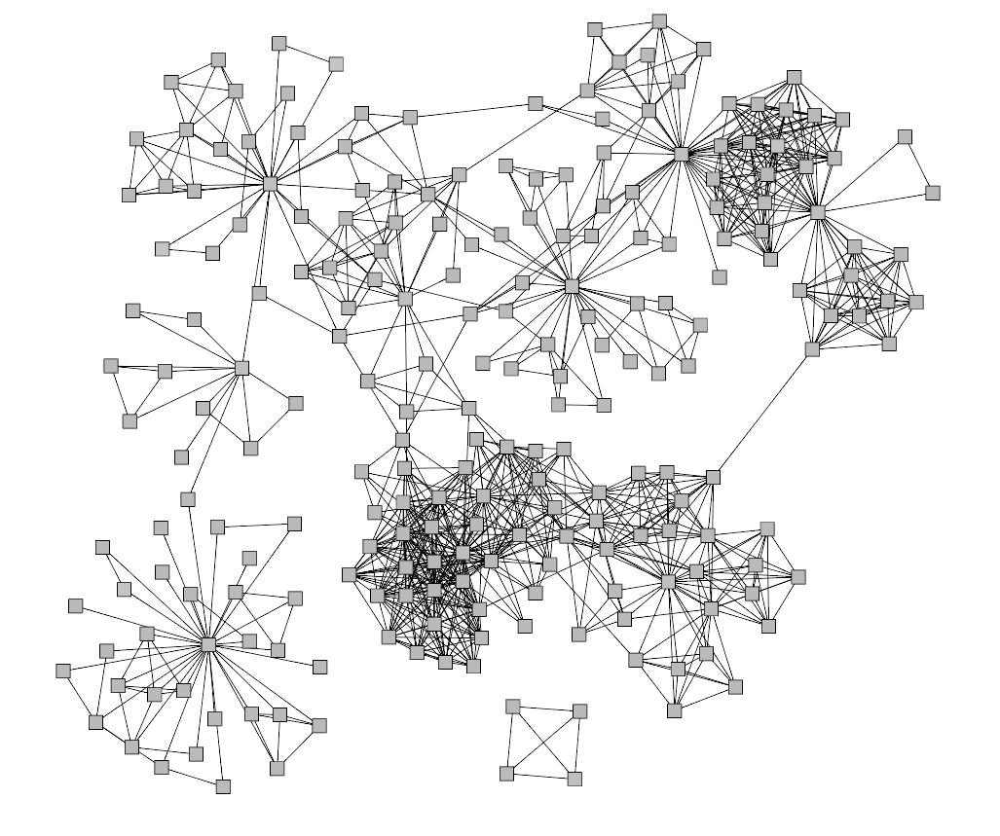
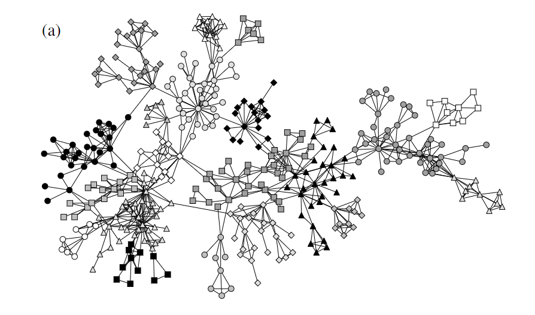
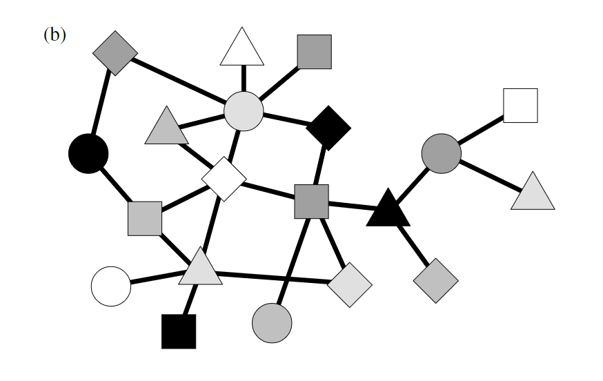

# Community structure

> 本书前几章讨论的技术，重点是网络结构的测量和模型，为这种理解提供了坚实的基础，但它们只是一个开始。我们现在的任务是应用我们所学到的知识来更深入地了解网络系统的功能。不幸的是，这方面的研究进展慢于测量和模型，但在一些领域取得了实质性进展，包括开发新的分析技术，如社区检测、网络故障和复原力研究，以及流行病和其他传播过程的研究。本书的其余章节将致力于描述我们目前对其中一些问题的理解。

    
    
图14.1：大学系的合著者网络。这个网络中的节点代表大学系中的科学家，而边则将两位合著科学论文的科学家联系在一起。该网络有明确的集群或“社区结构”，大概反映了该部门内部的利益和研究小组的分歧。

## Dividing network into group

区分网络的不同群体除帮助识别网络的集群结构外，还有另一个实际应用：允许我们将一个大型网络分解成可以单独研究的更小的子集，即对于现实中的超大型网络来说，对其中每一个节点做到可视化处理既困难也无助于分析，识别大型网络的群组并借此以群组来代替群组内部的节点，这种简化的表示即能使我们方便地理解这个网络的结构。

 
    
    

 
    图14.2：使用社区检测可视化网络结构。(A)中的网络被分解成其组成的社区，由不同的形状和颜色表示。在(B)中，网络中的每个社区由单个大节点表示，边缘指示哪些社区连接到哪个社区。在这个粗粒度的网络表示中，现在很容易看到连接的总体模式。

## Modularity maximization

简单来说，社区群组的划分目标是在于使得组内有足够多的连边，而组外有足够少的连边。但如何定义”足够“，这是个问题

我们定义一个社区评分系统，尽可能多的对网络的不同社区划分方式进行评分，选取高分社区划分方案来代表该网络的社区关系。高分的社区划分即如上：社区内部的边较多，而社区外部边较少

问题的关键在于选择一种评分机制使得优质的社区划分方法获得高分，在以前的章节{网络的分类混合现象}提到过这一问题**当大多数的边所连接的节点都是相同类型时，网络的得分相对较高，反之，当大多数的边所连接的节点属于不同类型时，网络的得分相对较低。**

该节对获取网络的一个较好社区划分的方法进行了详细的阐述，不过公式好多

### The form of the modularity function

$$
Q=\frac{1}{2 m} \sum_{i j}\left(A_{i j}-\frac{k_{i} k_{j}}{2 m}\right) \delta_{g_{i} g_{j}}=\frac{1}{2 m} \sum_{i j} B_{i j} \delta_{g_{i} g_{j}}
$$

该公式中$m$表示网络的总边数，$\delta_{g_{i} g_{j}}$表示**Kronecker delta**, $g_i$表示节点i所归属的社区编号，其中$B_{ij} = A_{ij}-\frac{k_ik_j}{2m}$。
$$
\begin{aligned}
\sum_{i} B_{i j} &=\sum_{i} A_{i j}-\frac{k_{j}}{2 m} \sum_{i} k_{i}=k_{j}-\frac{k_{j}}{2 m} 2 m=0, 
\\
\sum_{j} B_{i j} &=\sum_{j} A_{i j}-\frac{k_{i}}{2 m} \sum_{j} k_{j}=k_{i}-\frac{k_{i}}{2 m} 2 m=0,
\end{aligned}
$$

$$
s_{i}=\left\{\begin{array}{cl}
+1 & \text { if node } i \text { belongs to group } 1 \\
-1 & \text { if node } i \text { belongs to group } 2
\end{array}\right.
\\
\delta_{g_{i} g_{j}}=\frac{1}{2}\left(s_{i} s_{j}+1\right)
\\
Q=\frac{1}{4 m} \sum_{i j} B_{i j}\left(s_{i} s_{j}+1\right)=\frac{1}{4 m} \sum_{i j} B_{i j} s_{i} s_{j}
$$

### A simple modularity maximization algorithm

下面全是算法解释，不想看，直接跳过

