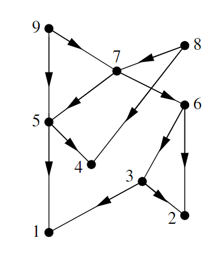
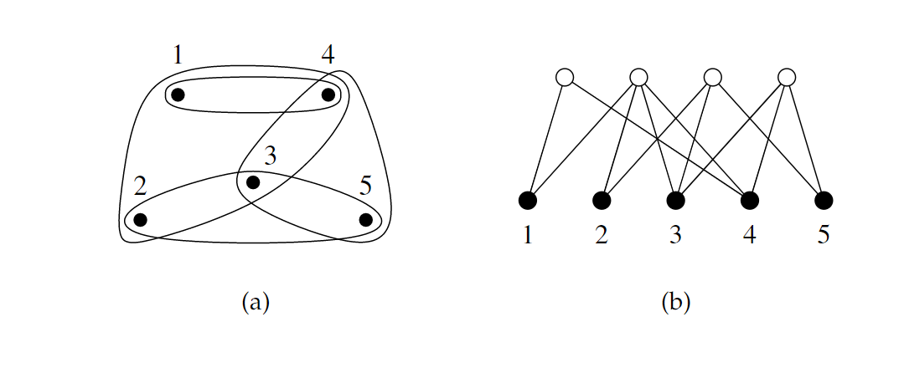
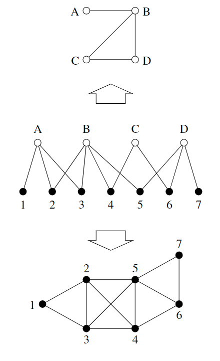
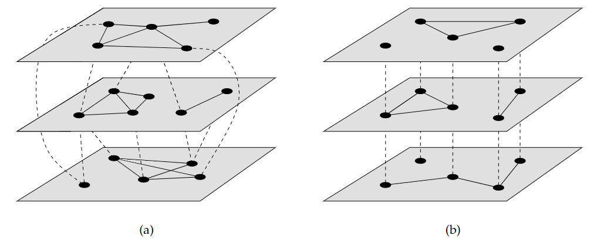
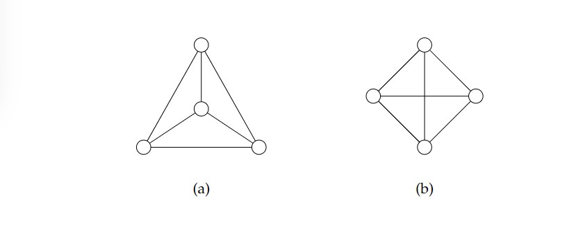

# 网络(Network)
网络是由节点(nodes)和边(edges)组合而成的图，其中节点的数量为**n**，连边的数量为**m**

**简单网络**：不包括自环（self loops）、自边(self edges)和多重边(multiedge)的网络

什么是自环(self loops)？什么是自边(self edges)？

**复杂网络**：包括以上元素的网络(self loops, self edges, multiedges)

## 邻接矩阵
邻接矩阵是网络最基础的数学表示方式，除此以外还有关联矩阵、拉普拉斯矩阵

对于一个具有n个节点的无向网络，一般采用一个$n\times n$的矩阵表示，矩阵中的元素$A_{ij}$表示节点i与节点j之间有边相连，并在矩阵中赋值为1，节点间未连接即赋值为0。
$$A_{i j}=\left\{\begin{array}{l}
1 \text { if there is an edge between nodes } i \text { and } j \\
0 \text { otherwise. }
\end{array}\right.$$
按照如上规则，可生成如下矩阵
$$\mathbf{A}=\left(\begin{array}{llllll}
0 & 1 & 0 & 0 & 3 & 0 \\
1 & 2 & 2 & 1 & 0 & 0 \\
0 & 2 & 0 & 1 & 1 & 1 \\
0 & 1 & 1 & 0 & 0 & 0 \\
3 & 0 & 1 & 0 & 0 & 0 \\
0 & 0 & 1 & 0 & 0 & 2
\end{array}\right)$$
矩阵有如下的特点：
- 无向网络中不区分边的方向，因此邻接矩阵中元素$A_{ij}$与元素$A_{ji}$表示的含义相同
- 无向网络的邻接矩阵以对角线部分为轴对称
- 而在有向网络中元素$A_{ij}$表示节点i指向节点j的边，元素$A_{ji}$表示节点j指向节点i的边，其具有不同的含义。
- 对于矩阵对角线的数据一般表示节点i的自环，而在拉普拉斯矩阵中，对角线数据常被作为节点的度数存在。
- 对于加权网络，矩阵中的每个元素值都表示该条边的权重

## **有向网络(Directed networks)**
有向网络与无向网络的差异在于连接节点的边的方向，有向网络中的边存在方向，即指示一个节点到一个节点的有向关系，如万维网中各个网页的链接，引文网络中各个文章之间的引用关系等，边定义了节点的出度与入度（指向某一节点的边为入度，而节点指向其他节点的边称为出度）。

有向网络在邻接矩阵的表示受边方向的影响，区别于无向网络的邻接矩阵的对称特点，其矩阵中的每个位置仅表示行节点到纵节点的单向链接。
$$\mathbf{A}=\left(\begin{array}{llllll}
0 & 0 & 0 & 1 & 0 & 0 \\
0 & 0 & 1 & 0 & 0 & 0 \\
1 & 0 & 0 & 0 & 1 & 0 \\
0 & 0 & 0 & 0 & 0 & 1 \\
0 & 0 & 0 & 1 & 0 & 1 \\
0 & 1 & 0 & 0 & 0 & 0
\end{array}\right)$$
元素$A_{ij}$表示节点i指向节点j的边，元素$A_{ji}$表示节点j指向节点i的边，其具有不同的含义。

**无向网络**：无向网络的边简单的被定义为节点之间的某种联系，如因特网中设备与设备之间的通路，城市交通网中各个区块间的道路等都可以作为无向网络的边。

### 无环网络（Acyclic networks）
有向网络中几条边循环指向周围的节点即称为环，在万维网中常出现这种情况。有向无环网络就变得特殊起来，最为常见的有向无环网络即为引文网络，文章只能引用更早发布的文章，因此网络按照边的顺序可以溯源到最早的一篇文章，这也反映了论文发表的时间顺序，其形状类似于一棵树。

$$\mathbf{A}=\left(\begin{array}{lllllllll}
0 & 0 & 1 & 0 & 1 & 0 & 0 & 0 & 0 \\
0 & 0 & 1 & 0 & 0 & 1 & 0 & 0 & 0 \\
0 & 0 & 0 & 0 & 0 & 1 & 0 & 0 & 0 \\
0 & 0 & 0 & 0 & 1 & 0 & 0 & 1 & 0 \\
0 & 0 & 0 & 0 & 0 & 0 & 1 & 0 & 1 \\
0 & 0 & 0 & 0 & 0 & 0 & 1 & 0 & 0 \\
0 & 0 & 0 & 0 & 0 & 0 & 0 & 1 & 1 \\
0 & 0 & 0 & 0 & 0 & 0 & 0 & 0 & 0 \\
0 & 0 & 0 & 0 & 0 & 0 & 0 & 0 & 0
\end{array}\right) $$
该网络仅有新节点指向老节点，无老节点指向新节点，因此矩阵中仅有上半部分的区域是存在数据的。

矩阵的对角线是严格为0的

## **加权网络(Weight networks)**
网络的边并不只是简单的表述一种恒定均等的关系，也能表示节点之间联系的强度，比如交通网络中两节点的实际距离等，加权网络就是为了描述这种关系而产生的
区别于无加权网络，加权网络为节点的每一条连边赋予了一定的权重值，节点i与节点j连边的权重即等于邻接矩阵在元素$A_{ij}$的值上。

边的权重一般为正值，但这并不表示它不能取负值，对于社交网络，我们把具有友谊的两个个体之间的连边权重设为正值，即使得矩阵中相应的元素取值为正；反之对于具有敌意的个体之间其连边即为负值。

## 超图与二分网络（hypergraphs and bipartite graph）
超图是另一种形式的网络，其中的节点通过参与某种组，与组内的其他成员建立了联系。如不同文章的论文作者、不同聚会的成员。这种囊括几个节点的节点关系叫做超边，具有超边的网络叫做超图。我们可以采用二分网络的形式来描述这种关系

上图即为一超图所对应的二分网络，超图中每个抽象节点集合都被视为二分网络的一个节点（白色），而超图中的节点与二分网络中的其他节点对应

而二分网络也能向两种节点进行投影

## 符号网络？(Sign networks)

## 多层网络和动态网络 Multilayer and dynamic networks

上图分别是多层网络和多重复用网络

a表示的多层网络可以代表不同关系的网络，层间虚线连接着不同层的节点，如几个城市间的铁路、陆路以及航空网络。
多层网络是一组单独的网络，其每一层都代表着不同类型的节点，层间节点存在可能的连边，即用来连接可能处于同一地理位置的不同类型节点。

b表示的多路复用网络的不同层节点代表的个体相同，不同的层可以代表具有不同特征的网络结构，社交网络的不同形式即可以采用这种形式表示。这种方式也可以代表动态网络或时序网络。

时序网络的节点关系会随着时间的推移而变化，

## 树Tree

## 平面网络 planar network

平面网络是指可以在平面上绘制而没有任何边相交的网络，如道路网，水网等

四色定理

