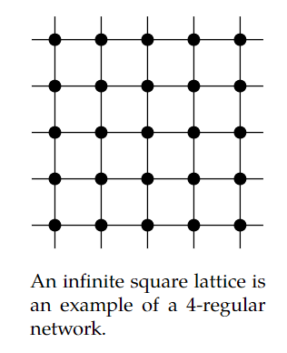
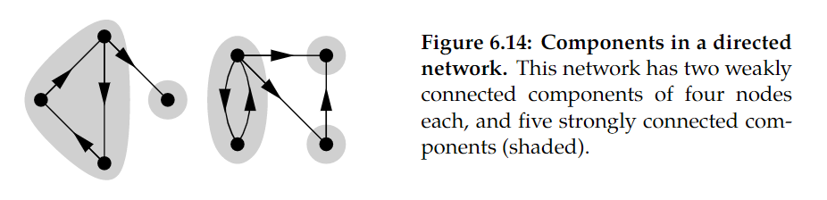
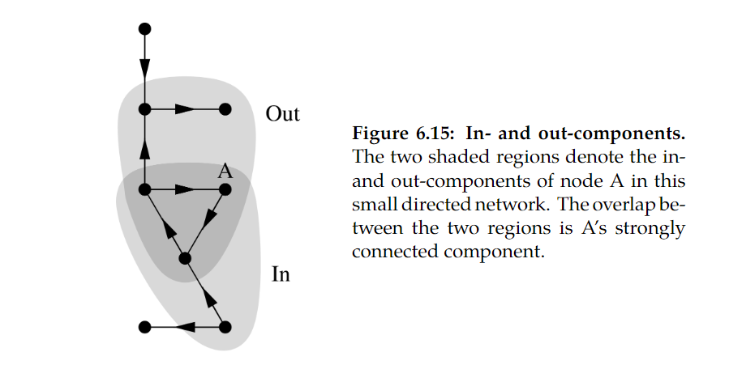

# 网络的基础参数

## 度Degree
无向网络中节点的度是连接到它的边的数量，常用符号$k_i$ 表示一个节点的度值，$m$ 表示一个网络边的数量，$n$ 表示网络节点的数量
$$k_i = \sum_{j = 1}^n{}A_{ij}$$

$$2m = \sum_{i = 1}^{n}{k_i} = \sum_{ij}{A_{ij}}$$

$c$ 表示网络的平均度
$$c = \frac{1}{n}\sum_{i = 1}^n{k_i} = \frac{2m}{n}$$

**k_regular network**：所有节点度值为k的网络

## 网络的密度和稀疏度（Density and sparsity）
对于一个具有n个节点的网络来说，其最大可能的边数为$n(n-1)/2$，网络的密度$\rho$即为：
$$\rho = \frac{m}{n(n-1)/2} = \frac{2m}{n(n-1)} = \frac{c}{n-1}$$
c 为网络的平均度。$\rho$越大说明网络内个节点联系越紧密

对于一个节点数为n的网络。如果密度ρ在n变大时保持非零值，则称网络是稠密的。在稠密网络中，邻接矩阵中非零元素的占比不为零；如果网络的$\rho→0$，即称为稀疏，且邻接矩阵中非零元素的占比趋于零。

生活中常见的网络都是稀疏的

## 有向网络度

有向网络的度区分为入度和出度，其二者相等

## 路径与步

网络中的walk可以用一系列的节点序号表示，其代表从起点到终点的行走方式。其可在有向网络和无向网络中定义（有向网络中的walk须按照边的方向前进，无向网络无要求），walk的长度length被定义为一段行走所经历的边的数量，而非节点的数量。

对于一条既不经过重复的边以及重复的点的walk我们称为path路径，最短路径和独立路径即为path的两种特殊情况。

使用邻接矩阵来计算指定节点之间的路径长度（networkx解决问题）

### 最短路径 shortes path
两节点的最短路径即为两节点间长度最小的路径。如果两节点并未在同一组件中，那么这两个节点可能没有联通的路径。

一个网络的长度即为该网络的最长的最短路径，即所有节点对最短路径的最大值。

最短路径不包括回环以及经过自身的路径

## 组件 Components
网络中的部分节点之间可能无任何连接起来的路径，其被分割在不同的空间内。
组件内所有的节点对间至少有一条可联通的路径。

## 有向网络中的组件

**弱连接组件**：在有向网络中，如果我们忽略边的方向，则以该准则判定的组件即为弱连接组件

**强连接组件**:几个节点能通过有向边形成能联通每个节点对的路径，那么这几个节点就可以称为该有向网络的强连接节点。
强连通分支是节点的最大子集，使得在子集内的每一对之间存在双向有向路径

**出组件：**对于某个节点来说，从该节点顺着有向边前进所能抵达的所有节点称为该节点的出组件
**入组件：**对于某个节点来说，从该节点逆着有向边前进所能抵达的所有节点称为该节点的入组件

某个节点的出组件和入组件即为囊括该节点的强连通组件。