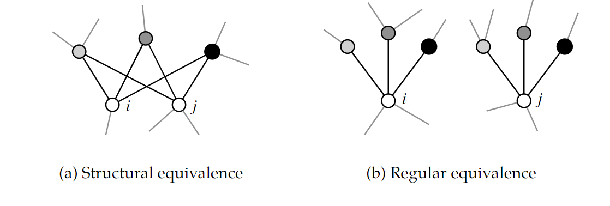
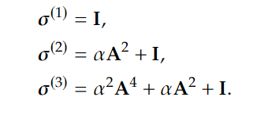
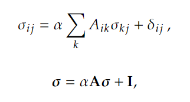

# Similarity 相似性
在网络中，为了匹配与给定节点最为相似的节点
- **structural equivalence 结构相似性:**
两个节点共享相同的邻居节点，如一个家庭内部两兄弟或姐妹，在亲属关系网络中该二节点都拥有同样的邻居（亲属）

- **Regular equivalence 规则相似性:**
两个节点的邻居是相似的，如某公司两个子公司的中层领导，在上下属关系网络中，该二节点的上司节点是具有结构相似性的，即拥有同样的总公司领导

## Structural equivalence 结构相似性
1. 直接衡量两点共同邻居的数量，即 
 $$n_{ij} = \sum_k A_{ik} A_{ij}$$
    - 节点间的相似性是一个相对概念，所以具体的邻居数无法作为两节点‘谁更与某节点相似’的节点，我们需要采用归一化的方法来校正这一误差，因此下式提供校正i、j节点自身度数的方法
3. 采用**余弦相似性**方法(cosine similarity)(Salton’s cosine)来衡量两节点相似性
    - > 余弦相似性通过测量两个向量的夹角的余弦值来度量它们之间的相似性，0度角的余弦值是1，而其他任何角度的余弦值都不大于1；并且其最小值是-1。从而两个向量之间的角度的余弦值确定两个向量是否大致指向相同的方向
    - > 
    - 我们将一个网络的邻接矩阵的i行与j行视为两个向量，采用计算两向量余弦相似性的方法计算其结构相似性得：

  - $\sigma_{i j}=\cos \theta=\frac{\sum_{k} A_{i k} A_{k j}}{\sqrt{\sum_{k} A_{i k}^{2}} \sqrt{\sum_{k} A_{j k}^{2}}} = \frac{n_ij}{\sqrt{k_i k_j}}$

    - 最后一个等式只适用于无权网络，对于度值为0的节点，其相似度 $n_ij = 0$

    - 以下将是一个案例展示（等我会画图了再来补）
3. 另外一个将相似性规约到0-1之间的相似度为**Jaccard coefficient**
   - $J_{i j}=\frac{n_{i j}}{k_{i}+k_{j}-n_{i j}}$

4. 采用**皮尔逊相关系数**（Pearson correlation coefficient）衡量两节点邻居的相似性
   -  $r_{i j}=\frac{\sum_{k}\left(A_{i k}-\left\langle A_{i}\right\rangle\right)\left(A_{j k}-\left\langle A_{j}\right\rangle\right)}{\sqrt{\sum_{k}\left(A_{i k}-\left\langle A_{i}\right\rangle\right)^{2}} \sqrt{\sum_{k}\left(A_{j k}-\left\langle A_{j}\right\rangle\right)^{2}}}$

5. 度量两节点向量的误差来衡量两节点的相似性
   - $h_{i j}=\sum_{k}\left(A_{i k}-A_{j k}\right)^{2}$]\
 
##  Regular equivalence规则相似性
 
规则等效节点是指虽然它们不一定共享邻居，但具有自身相似的邻居的节点
1. 计算方式1
基本思想是定义相似度分数$ σ_{i j}$ ，如果 i 和 j 的邻居 k 和 l 本身具有高相似度 ( 结构相似度? )，则 i 和 j 具有高相似度。
$$ \sigma_{ij} = \alpha\sum_{kl}{A_{ik}A_{jl}\sigma_{kl}}$$
$$\sigma=\alpha \mathbf{A} \mathbf{\sigma} \mathbf{A}$$
其中α是常数。虽然这可能不是很明显，但该表达式是一种特征向量方程，其中相似性的整个矩阵σ是特征向量

该方法的局限在于对于节点i与节点i的相似性, 采用该式计算所得无显著高相似性, 因此校正方法会添加$\mathbf{I}$以调整自相似性
另外,计算相似性$\sigma_{ij}$时所采用的递归方法计算各点的相似性如下所示
其中$\sigma^{(0)} = 0$, $\sigma^{(1)}=\alpha \mathbf{A} \mathbf{\sigma^{(0)}} \mathbf{A}$,迭代多次计算可取收敛后的相似性σ

2. 计算方式2

上图的计算方式考虑到节点i与节点j存在相同的, 节点 i 被认为与节点 j （虚线）相似，如果它有一个自身与 j 相似的邻居 k

3. 计算方式3
   考虑到高度节点存在较多的邻居节点, 因此对其度值进行校正后采用如下方法计算
   $$\sigma_{i j}=\frac{1}{k_{i}}\left[\alpha \sum_{k} A_{i k} \sigma_{k j}+\delta_{i j}\right]$$
   $$\sigma=(\mathbf{D}-\alpha \mathbf{A})^{-1}$$
   其中$\mathbf{D}$是图邻接矩阵的对角向量, 即代表节点i的度数
   

